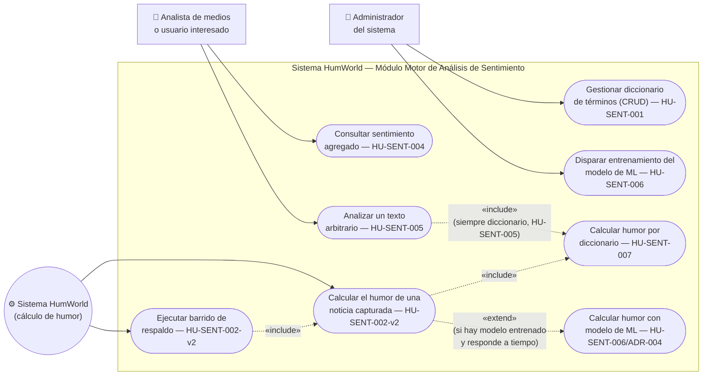

# Diagrama de Casos de Uso — Módulo Motor de Análisis de Sentimiento (EPIC-SENT)

**Proyecto:** HumWorld — Equipo 3
**Alcance:** Historias HU-SENT-001 a HU-SENT-007, según `HU-SENT-motor-sentimiento.md`.
**Origen:** PDF de especificaciones, sección 4.7.3.a ("Documentación UML de diseño → Diagrama de casos de uso").
**Estado de implementación:** Diseño — pendiente de implementación en código (ver `diagrama-clases-sentimiento.md` y `diagrama-componentes-sentimiento.md` para el mismo alcance a nivel de datos y componentes).
**Nota:** Este diagrama cubre únicamente EPIC-SENT, tal como `diagrama-casos-de-uso.md` (EPIC-RSS) ya anticipaba ("Los módulos EPIC-SENT, EPIC-DASH y EPIC-ADMIN tendrán su propio diagrama cuando se aborden esos sprints"). EPIC-DASH y EPIC-ADMIN siguen sin diagrama propio.

## Actores

| Actor | Rol en las historias |
|---|---|
| **Administrador del sistema** | Actor de las historias administrativas: gestión del diccionario (HU-SENT-001) y disparo manual del entrenamiento del modelo de ML (HU-SENT-006) — mismo criterio de actor ya usado en HU-RSS-001/002/004/005/007/008 y HU-RSS-009. |
| **Analista de medios o usuario interesado** | Actor de las historias de consulta (HU-SENT-004, HU-SENT-005), según el mismo rol ya definido en `diagrama-casos-de-uso.md` (EPIC-RSS) para HU-RSS-003-v2/HU-RSS-010, y grounded en PDF sección 4.1. |
| **Sistema HumWorld (cálculo de humor)** | Actor no humano: calcula el humor de cada noticia tras su captura (HU-SENT-002-v2, Enabler Story) y ejecuta el job de barrido de respaldo — mismo tipo de actor que "Sistema HumWorld (scheduler)" en el diagrama de EPIC-RSS. |

## Diagrama

## Notas de diseño

- **`UC2` (Calcular el humor de una noticia) es disparado por EPIC-RSS**, no por un actor humano de este módulo: `HU-SENT-002-v2` se ejecuta automáticamente tras cada captura exitosa de una noticia (ver `HU-RSS-006`/`HU-RSS-008` en `diagrama-casos-de-uso.md`). Este diagrama no redibuja los casos de uso de EPIC-RSS; la relación entre ambos módulos queda documentada aquí solo como nota textual, no como flecha entre diagramas separados.
- **`UC2` «include» `UCDicc` (Calcular humor por diccionario):** el método de diccionario (HU-SENT-007) es el camino que siempre se ejecuta o está disponible como red de seguridad — de ahí `«include»`, igual criterio que `diagrama-casos-de-uso.md` usó para "Capturar y deduplicar noticias".
- **`UC2` «extend» `UCML` (Calcular humor con modelo de ML):** a diferencia de la relación anterior, el camino de ML es **condicional** — solo se ejecuta si existe un modelo entrenado y responde dentro del timeout configurado (ver HU-SENT-002-v2, escenarios "Cálculo sin modelo de ML disponible" y "Timeout excedido"). Es la primera relación `«extend»` de la documentación de HumWorld: `diagrama-casos-de-uso.md` (EPIC-RSS) explícitamente no tenía ningún caso de comportamiento opcional condicional; EPIC-SENT sí lo tiene.
- **`UC5` (Analizar un texto arbitrario) «include» `UCDicc`, nunca `UCML`:** decisión documentada en HU-SENT-005 (nota de grounding) como propuesta del agente PO/Arquitecto pendiente de confirmación del equipo — este diagrama la refleja tal como está hoy en la historia; si el equipo la cambia, debe actualizarse aquí también.
- **`UCBarrido` (Ejecutar barrido de respaldo) «include» `UC2`:** el job periódico no reimplementa el cálculo, reutiliza el mismo caso de uso `UC2` sobre las noticias con `valor_humor IS NULL` (ver HU-SENT-002-v2 y `diagrama-componentes-sentimiento.md`).
- **HU-SENT-003 no aparece como caso de uso propio:** es persistencia (extiende el modelo `Noticia`), sin comportamiento observable distinto del que ya modelan `UC2`/`UCDicc`/`UCML` — mismo criterio que excluyó del diagrama de EPIC-RSS a historias puramente de modelo de datos.

## Historial de revisión

| Versión | Fecha | Motivo del cambio |
|---|---|---|
| v1.0 | 2026-09-29 | Creación inicial. Cubre HU-SENT-001, 002-v2, 004, 005, 006 y 007 (HU-SENT-003 excluida por no tener comportamiento observable propio). Primera relación `«extend»` de la documentación del proyecto, para el camino condicional de ML. |
