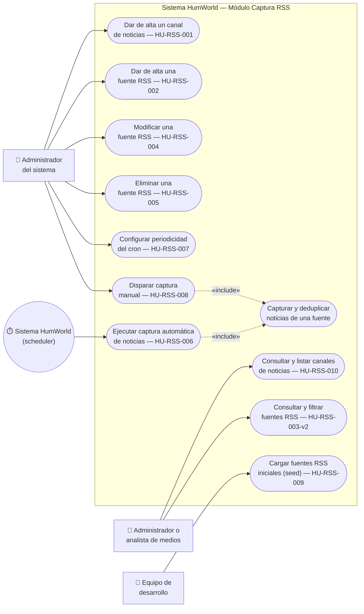

# Diagrama de Casos de Uso — Módulo Captura RSS (EPIC-RSS, Sprint 1)

**Proyecto:** HumWorld — Equipo 3
**Alcance:** Historias HU-RSS-001, 002, 003-v2, 004 a 010 (módulo de Captura y Gestión de Fuentes RSS), según `HU-RSS-captura.md`. No incluye HU-RSS-003, Deprecada en favor de HU-RSS-003-v2.
**Origen:** PDF de especificaciones, sección 4.7.3.a ("Documentación UML de diseño → Diagrama de casos de uso").
**Nota:** Este diagrama cubre únicamente EPIC-RSS (lo único implementado hasta ahora). Los módulos EPIC-SENT, EPIC-DASH y EPIC-ADMIN tendrán su propio diagrama cuando se aborden esos sprints.

## Actores

| Actor | Rol en las historias |
|---|---|
| **Administrador del sistema** | Actor de las historias administrativas de alta/gestión (HU-RSS-001, 002, 004, 005, 007, 008), según la convención de nombres fijada en `openspec/config.yaml` y `.github/copilot-instructions.md`. |
| **Administrador o analista de medios** | Actor de las historias de consulta (HU-RSS-003-v2, HU-RSS-010) — puede ser el mismo administrador u otro rol de solo lectura/auditoría. |
| **Sistema HumWorld (scheduler)** | Actor no humano: dispara la captura automática periódica (HU-RSS-006, Historia Técnica/Enabler). |
| **Equipo de desarrollo** | Actor no humano en tiempo de ejecución: ejecuta el procedimiento de carga inicial/seed (HU-RSS-009, Historia Técnica/Enabler). |

## Diagrama

## Notas de diseño

- **`«include»` entre HU-RSS-006/HU-RSS-008 y "Capturar y deduplicar noticias de una fuente":** ADR-002 (sección 2) es explícito en que la captura manual "reutiliza exactamente el mismo procedimiento de captura y deduplicación que el cron automático", por eso se modela como un caso de uso incluido compartido en lugar de duplicar el comportamiento en cada uno.
- **HU-RSS-006 y HU-RSS-009 son Historias Técnicas/Enabler** (el actor no es un usuario final humano, según la sección 4 de las instrucciones del proyecto) — se representan igualmente como casos de uso porque describen comportamiento observable del sistema, pero con actores no humanos (`Sistema HumWorld`, `Equipo de desarrollo`).
- **HU-RSS-001 y HU-RSS-010 comparten la entidad `CanalNoticias`** (alta y consulta respectivamente) sin relación de inclusión/extensión entre sí — son operaciones independientes sobre el mismo recurso, tal como quedó definido en la Guía P6.
- No se modelan aquí relaciones de `«extend»` porque ninguna historia actual describe un comportamiento opcional condicional sobre otro caso de uso ya definido.
