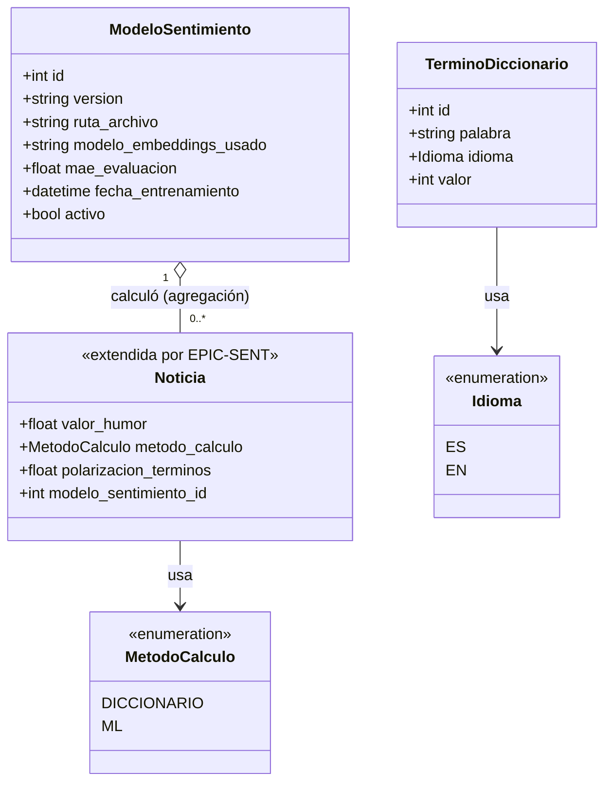

# Modelo de Clases / Entidad-Relación — Módulo Motor de Análisis de Sentimiento (EPIC-SENT)

**Proyecto:** HumWorld — Equipo 3
**Origen:** PDF de especificaciones, sección 4.7.3.b ("Documentación UML de diseño → Modelo Entidad/Relación o diagrama de clases"). Modelo decidido y justificado en `ADR-003-algoritmo-sentimiento.md` (algoritmo de diccionario) y `ADR-004-arquitectura-modelo-ml-sentimiento.md` (arquitectura del modelo de ML), y detallado por historia en `HU-SENT-motor-sentimiento.md` y en `contrato-sentimiento-diccionario.openapi.yaml`.
**Estado de implementación:** **Diseño — pendiente de implementación en código.** A diferencia de `diagrama-clases.md` (EPIC-RSS, que documenta el modelo ya implementado en el repositorio, Sprint 1), este diagrama refleja las decisiones de arquitectura ya tomadas para EPIC-SENT (Sprint 2 en adelante) pero que todavía no tienen código correspondiente en el repositorio. Debe actualizarse para reflejar el código real una vez implementado, siguiendo el mismo criterio que se usó para `diagrama-clases.md`.

## Diagrama

## Notas de grounding y campos pendientes de confirmación

- **`Noticia` es la misma entidad ya definida en `diagrama-clases.md` (EPIC-RSS)** — este diagrama no la redefine, solo muestra los atributos que EPIC-SENT le agrega o le da uso. `valor_humor` ya existía, nullable, reservado para este módulo (ver `diagrama-clases.md`).
- **`metodo_calculo`** (`"diccionario"` | `"ml"`): exigido explícitamente por el Gherkin de HU-SENT-002-v2 y HU-SENT-003 ("se registra el metodo_calculo usado"). Nullable mientras la noticia no tenga humor calculado (indicador de "pendiente", ver HU-SENT-002-v2 y HU-SENT-003).
- **`polarizacion_terminos`** (float, nullable): **nombre propuesto por `ADR-003-algoritmo-sentimiento.md`** (sección "Indicador complementario de polarización"), no confirmado todavía como nombre definitivo de campo — pendiente de que el equipo lo valide antes de la migración de base de datos (ver HU-SENT-003, Definition of Done).
- **`modelo_sentimiento_id`** (int, nullable, FK a `ModeloSentimiento`): el Gherkin de HU-SENT-002-v2 exige persistir "el identificador de versión del modelo usado" cuando `metodo_calculo="ml"`, pero ninguna HU ni ADR le asigna todavía un nombre de campo formal. **El nombre `modelo_sentimiento_id` es una propuesta de este diagrama, no una decisión ya tomada por el equipo** — debe confirmarse junto con `polarizacion_terminos` antes de la migración de base de datos.
- **`TerminoDiccionario`** corresponde 1:1 al esquema `TerminoDiccionario` de `contrato-sentimiento-diccionario.openapi.yaml` (HU-SENT-001). `idioma` está acotado a español/inglés por el alcance del PDF (sección 3, punto 2).
- **`ModeloSentimiento`** corresponde a la tabla de metadatos `modelos_sentimiento` definida en `ADR-004-arquitectura-modelo-ml-sentimiento.md`, sección "Esquema de versionado de modelos" — mismos campos, mismos tipos.
- **No existe una relación persistida entre `Noticia` y `TerminoDiccionario`.** El método de diccionario (HU-SENT-007) compara el texto de la noticia contra el diccionario **en el momento del cálculo**, sin persistir una tabla de unión — por eso no se dibuja ninguna asociación entre ambas clases. Si en el futuro se necesitara auditar qué términos específicos coincidieron en cada noticia, sería una extensión nueva de HU-SENT-007, no contemplada hoy.
- **`ModeloSentimiento` "1" o-- "0..\*" `Noticia` (agregación, no composición):** una `Noticia` calculada con un modelo no depende de que ese modelo exista para seguir teniendo sentido (su `valor_humor` ya quedó fijado); y un `ModeloSentimiento` puede existir con cero noticias calculadas aún (justo después de entrenarse). Ninguna de las dos vive ni muere por la otra — de ahí la agregación, coherente con el mismo criterio ya aplicado a `FuenteRSS`──`Noticia` en `diagrama-clases.md`.
- **`ruta_archivo`** es la ubicación en disco/volumen Docker del regresor serializado (`.joblib`, ver ADR-004) — es un dato interno del backend, no se expone en la respuesta de `POST /api/v1/trainings` (ver `contrato-sentimiento-diccionario.openapi.yaml`, esquema `ModeloSentimiento`, nota de diseño).

## Historial de revisión

| Versión | Fecha | Motivo del cambio |
|---|---|---|
| v1.0 | 2026-09-29 | Creación inicial. Modela la extensión de `Noticia` (metodo_calculo, polarizacion_terminos, modelo_sentimiento_id — estos dos últimos como nombres de campo propuestos, no confirmados) y las nuevas entidades `TerminoDiccionario` y `ModeloSentimiento`, a partir de `ADR-003`, `ADR-004`, `HU-SENT-motor-sentimiento.md` y `contrato-sentimiento-diccionario.openapi.yaml`. Diagrama de diseño, sin código correspondiente todavía. |
