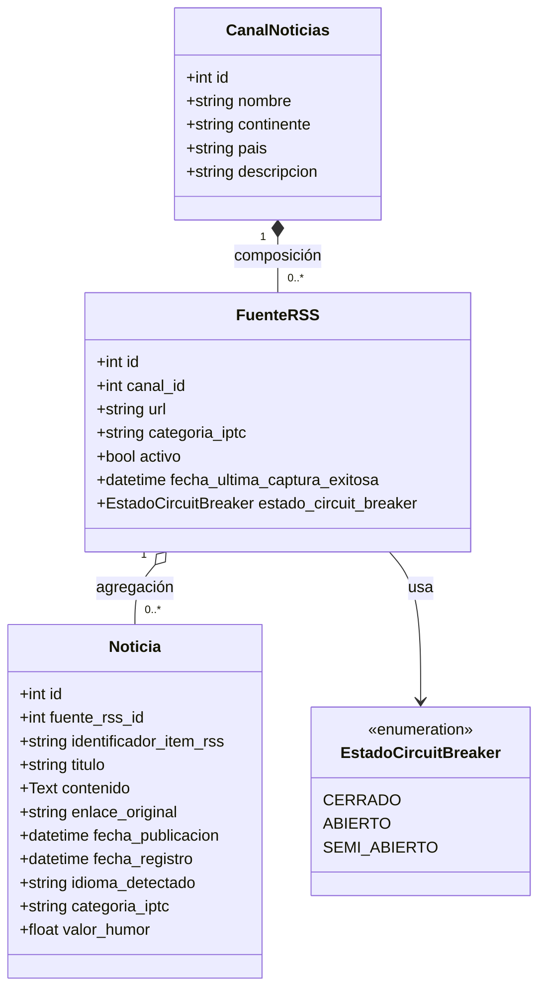

# Modelo de Clases / Entidad-Relación — Módulo Captura RSS (EPIC-RSS, Sprint 1)

**Proyecto:** HumWorld — Equipo 3
**Origen:** PDF de especificaciones, sección 4.7.3.b ("Documentación UML de diseño → Modelo Entidad/Relación o diagrama de clases"). Modelo ya decidido y ratificado en `ADR-002-arquitectura-captura-rss.md`, sección 1.
**Formato elegido:** diagrama de clases UML (en lugar de E/R puro), porque el PDF ofrece ambos como equivalentes y el diagrama de clases permite expresar directamente las relaciones de **composición** y **agregación** que ADR-002 exige modelar explícitamente (instrucciones del proyecto, sección 8).

## Diagrama

## Justificación de las relaciones (ver ADR-002, sección 1)

- **`CanalNoticias` ◆── `FuenteRSS` (Composición):** una `FuenteRSS` no tiene existencia ni sentido de negocio independiente de su `CanalNoticias` contenedor. Coherente con la instrucción explícita de la sección 8 del proyecto, que usa exactamente este par de entidades como caso de referencia de composición, y con la implementación real (`app/models/canal.py`, relación `cascade="all, delete-orphan"`).
- **`FuenteRSS` ── `Noticia` (Agregación):** una `Noticia`, una vez capturada, tiene valor informativo y analítico propio e independiente del ciclo de vida de su fuente — alimenta series históricas de humor que deben sobrevivir incluso si la fuente se da de baja. A diferencia de `CanalNoticias.fuentes` (que sí declara `cascade="all, delete-orphan"`), la relación `FuenteRSS.noticias` en `app/models/fuente.py` **no** declara cascade de borrado — eso es lo que en el código actual la hace consistente con una agregación y no con una composición. **Aclaración importante:** el propio docstring de `app/models/noticia.py` y ADR-002 (sección "Consecuencias") marcan la política de borrado en cascada de `Noticia` como **punto abierto, pendiente de validación por el equipo** — que `HU-RSS-005` implemente *soft delete* (`activo=false`) en `FuenteRSS` es una decisión de la capa de servicio y no cierra por sí sola esa pregunta de diseño. Este diagrama documenta el estado actual del código, no una decisión ya ratificada.
- **`estado_circuit_breaker`** es un atributo de `FuenteRSS`, no una entidad propia — modela el patrón de resiliencia Circuit Breaker por fuente individual (ADR-002, sección 3).
- `valor_humor` en `Noticia` queda **nullable** y fuera del alcance de EPIC-RSS: lo calcula el módulo de Análisis de Sentimiento (EPIC-SENT, no implementado todavía).

## Correspondencia con el código implementado

| Elemento del diagrama | Fichero real en el repositorio |
|---|---|
| `CanalNoticias` | `src/app/models/canal.py` |
| `FuenteRSS`, `EstadoCircuitBreaker` | `src/app/models/fuente.py` |
| `Noticia` | `src/app/models/noticia.py` |
