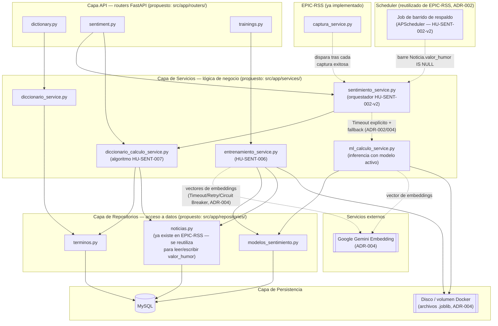

# Diagrama de Componentes — Módulo Motor de Análisis de Sentimiento (EPIC-SENT)

**Proyecto:** HumWorld — Equipo 3
**Origen:** PDF de especificaciones, sección 4.7.3.c ("Documentación UML de diseño → Diagrama de componentes"). Arquitectura en capas ya decidida en `ADR-001-stack-backend.md`, y extendida por `ADR-003-algoritmo-sentimiento.md` y `ADR-004-arquitectura-modelo-ml-sentimiento.md`.
**Estado de implementación:** **Diseño — pendiente de implementación en código.** A diferencia de `diagrama-componentes.md` (EPIC-RSS, que refleja los componentes ya implementados en el repositorio), este diagrama es aspiracional: describe cómo deberían organizarse los componentes de EPIC-SENT siguiendo la misma separación de capas ya usada en EPIC-RSS (routers → servicios → repositorios), pero ningún nombre de fichero aquí está verificado contra código real todavía. Debe corregirse en cuanto el equipo empiece a implementar Sprint 2.

## Diagrama

## Reglas de dependencia (mismo criterio que ADR-002, sección 4, aplicado a EPIC-SENT)

- Los routers no acceden a MySQL ni a servicios externos directamente: solo validan entrada (Pydantic, según los esquemas de `contrato-sentimiento-diccionario.openapi.yaml`) y delegan a la capa de Servicios.
- `sentimiento_service.py` es el **orquestador** de HU-SENT-002-v2: aplica el Timeout explícito sobre `ml_calculo_service.py` y cae a `diccionario_calculo_service.py` (HU-SENT-007) si se excede el timeout o el modelo falla — mismo patrón de resiliencia ya evaluado en `ADR-004`.
- `ml_calculo_service.py` es el único componente que llama a Google Gemini Embedding para el cálculo por noticia; `entrenamiento_service.py` es el único que la llama para generar el conjunto de entrenamiento completo — ambos aplican los patrones de resiliencia de `ADR-004` (Timeout, Retry acotado, Circuit Breaker), reutilizando el mismo diseño ya aprobado en `ADR-002` para las fuentes RSS.
- El job de barrido reutiliza el **mismo scheduler interno** (`APScheduler`) que EPIC-RSS ya usa para el cron de captura (ver `diagrama-componentes.md` y `ADR-002`, sección 2) — no se introduce un segundo mecanismo de scheduling.
- `repositories/noticias.py` es compartido con EPIC-RSS: EPIC-SENT no crea un repositorio nuevo para `Noticia`, solo le agrega operaciones de lectura/escritura de los campos que le pertenecen (`valor_humor`, `metodo_calculo`, `polarizacion_terminos`, `modelo_sentimiento_id` — ver `diagrama-clases-sentimiento.md`).

## Componentes cuyo nombre de fichero es una propuesta de este diagrama, no una decisión ya tomada

Ningún documento fuente (PDF, HU, ADR) fija nombres de módulo/fichero — son una convención propuesta por este diagrama, siguiendo el mismo patrón de nombres ya usado en el código de EPIC-RSS (`*_service.py`, `repositories/*.py`). El equipo puede ajustarlos libremente al implementar, sin que eso invalide las decisiones de arquitectura de `ADR-003`/`ADR-004` que sí están ratificadas.

## Historial de revisión

| Versión | Fecha | Motivo del cambio |
|---|---|---|
| v1.0 | 2026-09-29 | Creación inicial. Componentes propuestos para EPIC-SENT (routers `dictionary`/`sentiment`/`trainings`, servicios de orquestación/diccionario/ML/entrenamiento, repositorios de términos y modelos, reutilización del repositorio de noticias y del scheduler de EPIC-RSS) a partir de `ADR-003`, `ADR-004` y `HU-SENT-motor-sentimiento.md`. Diagrama de diseño, sin código correspondiente todavía. |
