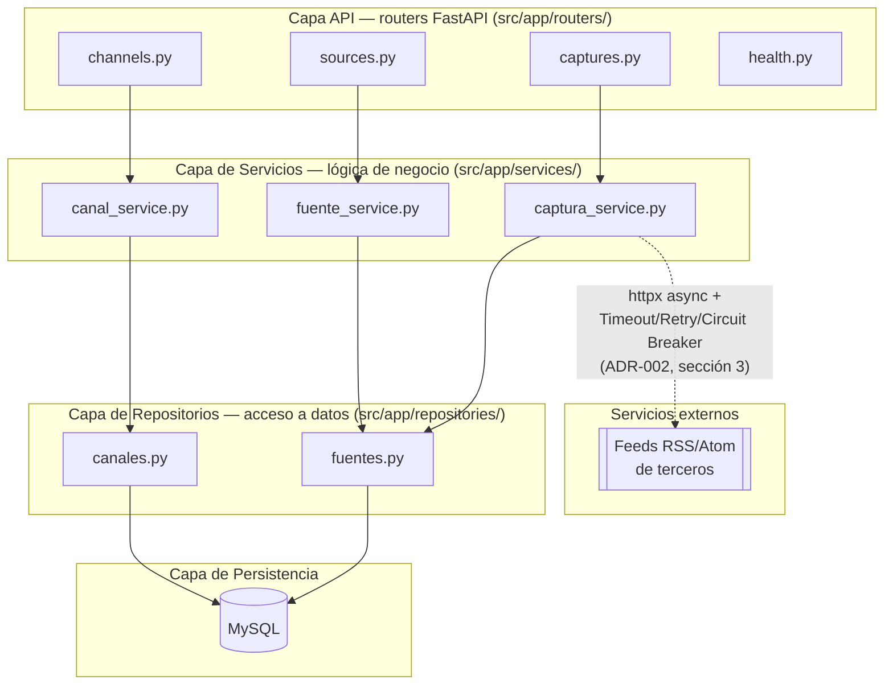

# Diagrama de Componentes — Módulo Captura RSS (EPIC-RSS, Sprint 1)

**Proyecto:** HumWorld — Equipo 3
**Origen:** PDF de especificaciones, sección 4.7.3.c ("Documentación UML de diseño → Diagrama de componentes"). Arquitectura en capas ya decidida en `ADR-001-stack-backend.md` y `ADR-002-arquitectura-captura-rss.md`, sección 4 ("Separación de capas").
**Alcance:** refleja los componentes efectivamente implementados en el repositorio a la fecha (routers, servicios y repositorios de `channels` y `sources`), no un diseño aspiracional.

## Diagrama

## Reglas de dependencia (ADR-002, sección 4 — verificadas contra el código actual)

- Los routers (`API`) **no acceden a MySQL ni contienen sentencias SQL**: solo validan entrada (Pydantic) y delegan a la capa de Servicios.
- Los Servicios **no dependen de FastAPI**: reciben la sesión de base de datos como parámetro y devuelven datos o lanzan excepciones de dominio (`ChannelNameConflictError`, `FuenteRSSNotFoundError`, etc., en `src/app/exceptions.py`).
- Toda sentencia de acceso a datos vive **únicamente** en la capa de Repositorios (`app/repositories/`).
- Toda llamada a un feed RSS externo (`captura_service.py`, HU-RSS-006/008) debe aplicar Timeout explícito, Retry acotado con backoff exponencial y Circuit Breaker por fuente — patrones de resiliencia obligatorios definidos en ADR-002, sección 3.

## Componentes que aparecen en el modelo pero aún no están implementados

- `config.py` / router de Configuraciones (`GET`/`PUT /api/v1/config`, HU-RSS-007) — no forma parte del código ya subido al repositorio.
- El propio job de scheduler (`app/jobs/scheduler.py` existe en el repo, pero está deshabilitado explícitamente en `app/main.py` hasta que se implemente HU-RSS-006).
- `src/scripts/seed.py` (HU-RSS-009) sí existe en el repositorio, pero no se representa como componente de la API en este diagrama porque se ejecuta fuera del ciclo de vida de la aplicación (script independiente).
